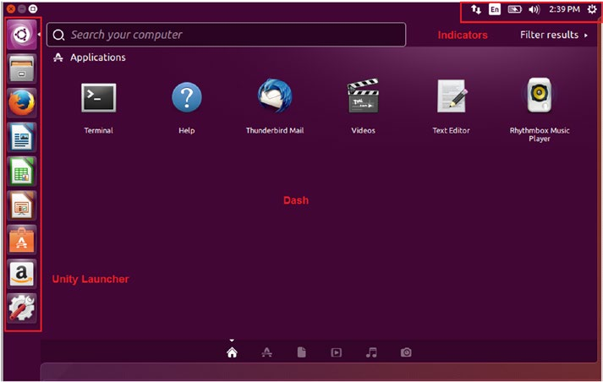
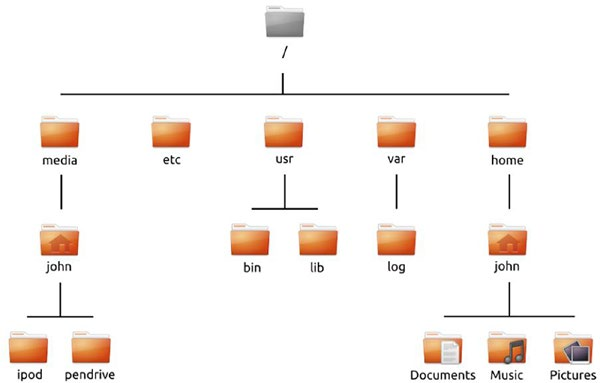
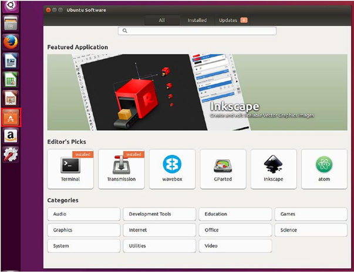
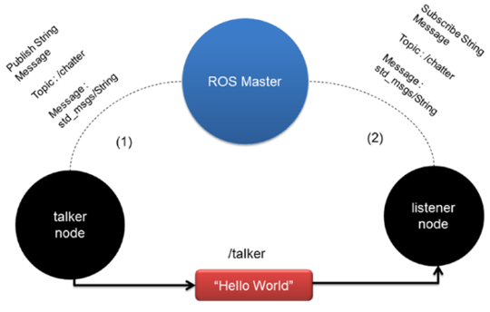

# Electiva Técnica I - Introducción *Robot Operating System* (ROS1)

### David Rozo Osorio, I.M, M.Sc.

## Introducción a Linux System

- Objetivo: comprender el funcionamiento de un sistema operativo tipo Linux.


- Procedimiento:
 1. Características de la máquina virtual.
 2. Introducción.
 3. Características del S.O. - Gráfico.
 4. Operaciones básicas con la Terminal.

### Características para una máquina virtual

El proceso de instalación puede ser implementado de 2 formas:

- **Instalación con arranque paralelo**. En el siguiente [link](https://www.youtube.com/watch?v=x1ykDpSzpKU) puede visualizar el proceso. Nota: este proceso debe ser desarrollado con cuidado porque en caso de que se presente algún incidentes puede perder toda la información que tenga en computador.
- **Máquina virtual** [link descarga](https://www.virtualbox.org/). En el siguiente [link](https://www.youtube.com/watch?v=x5MhydijWmc) puede visualizar el proceso (recomendado). Configuración máquina virtual (óptimo) [mínimo]:
  - Disco virtual 25GB o más. [15 GB].
  - Memoria RAM 4 GB o más. [2 GB].
  - CPU 2 o más. [1].
  - Se requiere de una instalación completa (no de prueba).
  - Se recomienda instalar la versión en Inglés de Ubuntu.
  - Ubuntu 20.04 https://ubuntu.com/download/desktop

<p style="page-break-after:always;"></p>

### Introducción Ubuntu

Sistema Operativo basado en Unix, desarrollados como parte del Proyecto GNU.

- Multitasking.
- Multiusuario.
- Software de uso libre y código abierto.
- Distribuciones populares:
  - Ubuntu
  - Debian
  - Fedora

Ej. Android, utiliza un núcleo tipo Linux.







### CommandLine 

- `ls`: List Directory
  - `ls -a`: Extra parameter that shows all hidden elements in a folder.
  - `ls --help`: Extra parameters that present all extensions. 
  
- `cd`: Change Directory.
  - `cd ..`: Change directory to the previous.
  - `cd --`: Change to HOME directory.

- `clear`: erase all content of the terminal window.
- `pwd`: Current terminal path.
- `mkdir`: Create a folder.
- `rm`: Delete file.
- `rmdir`: Delete folder.
- `mv`: Move file.
- `cp`: Copy file.
- `wget`: Command to download files from the internet. 
- `sudo`: Run a command Admin Mode.
- `apt-get`: Install Package Ubuntu.
- `nano`: Text editor in terminal.
- `sudo apt update`: update the Operating System.
- `sudo apt upgrade`: erase older Operating System Files.

Nota: `man`: Open a manual of a command.


## Introducción a ROS1

- Objetivo: comprender el funcionamiento y las características preliminares de ROS1


- Procedimiento:
 1. ROS - Master
 2. ROS - Node operations
 3. ROS - Topic operations
 4. ROS - Launch
 5. ROS - Demo



### CommandLine

- `roscore`: inicia el ROS-Master, el servidor de parámetros y el nodo de logging.
```bash
$ roscore
```
- `rosnode`: comando que explora características de los nodos. Cada comando tiene una serie de modificadores o atributos que permiten realizar operaciones. Para identificar todos los atributos disponibles, se utiliza el modificador `-h` signficado "*help*"
  
  - **Ej**. Listar los nodos activos.
```bash
$ rosnode list
```

- `rostopic`: comando que provee información de los *topics* activos.

  - **Ej.** Listar *topics* activos.
```bash
$ rostopic list
```
  - **Ej**. Imprimir información del *topic*.
```bash
$ rostopic echo /<topic_name>
```
  - **Ej.** Publicar información en un *topic*.
```bash
$ rostopic pub <topic_name> <msg_type> data
$ rostopic pub /hello std_msgs/String "Hello"
```
```bash
$ rostopic pub -1 /hello std_msgs/String "Hello"
$ rostopic pub /hello std_msgs/String -r1 -- "Hello"
```

- `rosmsg`: comando que provee información sobre los tipos de mensajes.
  - **Ej.** mensaje tipo *string*.
```bash
$ rosmsg show std_msgs/String
```
  - **Ej.** mensaje tipo *Twist*.
```bash
$ rosmsg show geometry_msgs/Twist
```

- `rosrun`: comando que permite ejecutar nodos
```bash
$ rosrun <ros_pkg_name> <ros_node_name>
$ rosrun roscpp_tutorials talker
``` 

- `rqt_graph`: nodo que construye un gráfico de los *topic* y *node* activos.
```bash
$ rqt_graph
```

### ROS Demo (Talker and Listener)

- Iniciar ROS Master.
```bash
$ roscore
```

- Ejecutar nodos.

  - Iniciar el nodo "talker"
```bash
$ rosrun roscpp_tutorials talker
```
  - Ejecutar  el nodo "listener"
```bash
$ rosrun roscpp_tutorials listener
```

- Ejecutar comandos para *topics*
```bash
$ rostopic list
```

### ROS Demo (Turtlesim)

- Iniciar ROS Master.
```bash
$ roscore
```

- Ejecutar nodos.

  - Iniciar el nodo "turtlesim_node"
```bash
$ rosrun turtlesim turtlesim_node
```
  - Ejecutar el nodo "teleop"
```bash
$ rosrun turtlesim turtle_teleop_key
```
  - Ejecutar el nodo "movimiento autónomo"
```bash
$ rosrun turtlesim draw_square
```

- Ejecutar comandos para *topics*
```bash
$ rostopic list
```
```bash
$ rostopic pub -1 /turtle1/cmd_vel geometry_msgs/Twist '[2.0,0.0,0.0]' '[0.0,0.0,1.0]'
$ rostopic pub /turtle1/cmd_vel geometry_msgs/Twist -r1 -- '[2.0,0.0,0.0]' '[0.0,0.0,1.0]'
```

- Ejecutar el nodo "*Graph*"
```bash
$ rosrun rqt_graph rqt_graph
```

## Referencias

- Understanding ROS Nodes: http://wiki.ros.org/ROS/Tutorials/UnderstandingNodes

- Understanding ROS Topics: http://wiki.ros.org/ROS/Tutorials/UnderstandingTopics

- Lentin Joseph, Robot Operating System (ROS) for Absolute Beginners, Apress. 2018.

- Ramkumar Gandhinathan, Lentin Joseph, ROS Robotics Projects, 2ed, Packt, 2019.

- Morgan Quigley, Brian Gerkey, and William D. Smart., Programming Robots with ROS, O’ Reilly Media, Inc., 2016.
